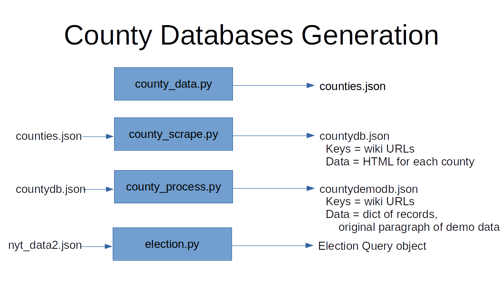

# counties

Basic diagram, to generate the databases needed:

To grab a pre-generated copy of the database files, use docker:

    docker run hachulhavsum/dbs | tar zxf -

Once you have the database files, then the python accessor election.py module should work.

